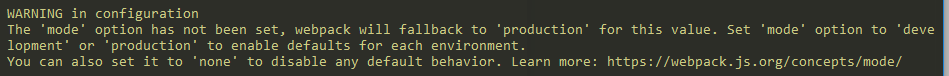
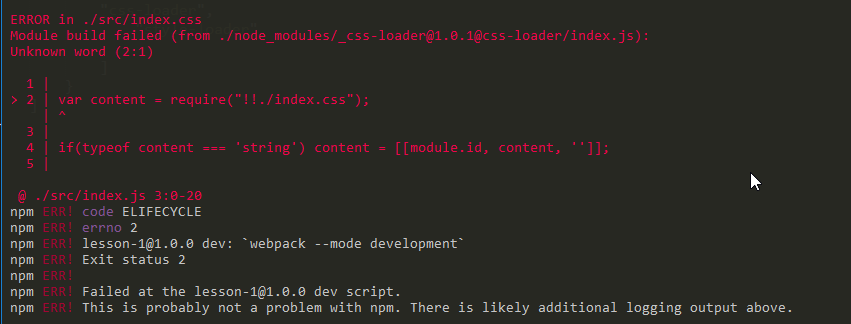

## webpack

- [lesson-1]() 
- [lesson-2]() 多入口，多出口，
- [lesson-3]() HMR 热模块加载 webpack-dev-server, clean-webpack-plugin
- [lesson-4]() 
- [lesson-5]() html-webpack-plugin 模块
- [lesson-6]() css-loader 静态资源
- [lesson-7]() babel 处理js-es6转es5等， eslint配置使用
- [lesson-8]() 全局变量引入
- [lesson-9]() 图片处理的几种场景
- [lesson-10]()


webpack在4这个版本，需要安装2个,最好局部安装webpack,避免因为版本不同，对项目产生影响

~~~
cnpm install --save-dev webpack webpack-cli
~~~

官网的那个 npx webpack 如果是本地安装,进入目录是比较麻烦的，我们在package.json中配置一下就好

```js
    "scripts": {
        "build": "webpack --mode development"
    },
```

最好把mode配置进去，没有配置mode模式，控制台会报警告,就2种模式，开发模式(development),生成模式(production)



### 加载css

安装依赖
```js
    cnpm install --save-dev style-loader css-loader
```

Use

在使用的时候，需要使用规则解析，先使用style-loader，再使用css-loader,顺序是不能变的

在使用的时候，直接import './src/some.css' 就可以

```js
    module: {
        rules: [
            {

                test: /\.css$/,
                use: ["style-loader", 'css-loader']
            }
        ]
    }
```



### 处理图片

- js动态添加图片
    + import imageUrl from "图片地址"
- 在html中直接插入img标签（不使用）
    + 这种方式没什么用，不会被webapck打包
- 在css中直接使用background: url  指向一个路径
    + background: url()

```js
    cnpm install --save-dev file-loader
```

### 字体文件的处理

也是使用file-loader进行处理，从阿里巴巴字体库下载测试加载不同的字体图标


### 在index中自动插入js -- HtmlWebpackPlugin 动态打包

会在dist下面重新生成一个全新的index.html文件

### 清理dist发布包下没有使用的文件--CleanWebpackPlugin

dist如果没有被webpack所追踪，没有引用的话，就会被直接删除，是删除dist目录，重新建一个打包后的dist目录

### 使用source map 帮助代码定位调试（开发环节使用）

### 使用不同的方式调试代码

- watch 通过设置webpack 的监听模式，达到代码改动，立即生效的作用，缺点： 需要手动刷新页面
- webpack-dev-server 插件 自己启动服务，只需我们在webpack.config.js指定入口即可。
    + 在package.json中最好配置指定mode 不然会有警告
- webpack-dev-middleware插件，单独使用


### 防止重复引用公共的插件，避免文件过大 CommonsChunkPlugin(webpack4以下用), SplitChunksPlugin用在webpack 4.X版本


---
SplitChunksPlugin

>   chunk 就是代码块，默认一个entry,对应一个output 即打包后只形成一个chunk

**Defaults**

开箱即用的SplitChunksPlugin应该更受用户青睐

默认情况下，它仅影响按需块，因为更改初始块会影响HTML文件应包含的脚本标记以运行项目

SplitChunksPlugin将基于下面的条件，自动切割chunk

- 可以共享新chunk或来自node_modules文件夹的模块
- 在通过min+gz压缩后，新chunk应该大于30kb
- 根据需要加载chunk时的最大并行请求数应该小于或等于5
- 初始页面加载时的最大并行chunk数应该小于或等于3

在试图满足最后2个条件的情况下，最大的chunks数量是首选


**Configuration**

对于开发者而言，想要更好的掌握这个功能，webpack提供了一组选项，更好的满足你的需求

如果你手动你更改代码拆分的配置项，预估这些配置项的改变会对你有真的好处。

>   选择默认配置以适应Web性能最佳实践，但项目的最佳策略可能会延迟，具体取决于其性质。

**Configuring cache groups**

默认值将所有模块从node_modules分配给名为vendors的缓存组，并将所有模块至少重复2个块复制到缓存组default。

一个module可以被分配到多个缓存组(cache groups) 然后,最优选择器将从较高优先级的缓存组（优先级选项）或优先级较高的chunks。

**Conditions(条件)**

当满足所有的条件，来自相同的chunks和cache group 的模块，将形成新的chunk。

配置条件有4个选项：

- minSize (default: 30000) 一个chunk最小的大小
- minChunks (default: 1)分割前共享模块的最小块数
- maxInitialRequests (default 3) 入口点处的最大并行请求数
- maxAsyncRequests (default 5) 按需加载时的最大并行请求数

**Naming**
要控制拆分块的块名称，可以使用name选项。

>   为不同的拆分块分配相同的名称时，所有vendor模块都放在一个共享块中，不建议这样做，因为它可以导致更多的代码下载。

这个神奇的配置是true，会根据chunk和缓存组(cache group)键自动选择名称，否则可以传递字符串或函数。

当名称与入口点名称匹配时，将删除入口点。

optimization.splitChunks.automaticNameDelimiter


