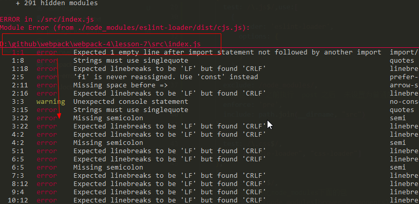

## ES6 转ES5

### 安装模块

主要就是下面这3个包，然后其他的pollyfii 在通过配置的方式注入
```
npm install babel-loader @babel/core @babel/preset-env --save-dev

或

yarn add babel-loader @babel/core @babel/preset-env --D
```

### 使用

webpack.cofig.js

```
module.exports = {
  ...
  module: {
    rules: [
      {
        test: /\.js$/,
        // 不要去转化node_modules下面的包
        exclude: /(node_modules|brower_components)/,
        // 从 src目录下面去转换
        include: path.resolve(__dirname, "src"),
        use: {
          loader: "babel-loader",
          options: {
            presets: ["@babel/preset-env"],
            plugins: [
              "@babel/plugin-proposal-decorators",
              "@babel/plugin-proposal-class-properties"
            ]
          }
        }
      }
    ]
  }
}
```

安装类的装饰器

```
npm install --save-dev @babel/plugin-proposal-decorators
npm install --save-dev @babel/plugin-proposal-class-properties
```
配置类的装饰器，看上面的plugins中， 唯一需要注意的是，proposal-clsss-properties需要在proposal-decorators之后

[babel官网关于修饰器地址](https://babeljs.io/docs/en/babel-plugin-proposal-decorators)

bable的插件安装都是  @babel/插件名  这种规则的

index.js 入口文件
```
// es6定义一个类
@di
class Foo {
  constructor(x,y) {
    this.x = x
    this.y = y
  }

  say() {
    console.log(this.x, this.y)
  }
}

let p = new Foo(1,2)

function di(target) {
  console.log("装饰器函数", target)
}
p.say()

```

di是一个装饰器函数

运行前和运行后，放到ie中查看，即可知道是否转换成功


通过添加以下的插件，能够帮我们解析一些高级语法问题，比如 generator

注意下面的开发依赖和生产依赖
```
开发依赖
npm install --save-dev @babel/plugin-transform-runtime

生产依赖
npm install --save @babel/runtime
```
然后，我们在解析转换的时候，需要排除node_module目录，然后去我们的src目录去转换js， 所以需要注意上面的 webpack.config.js中的 exclude和include配置，不然控制台有 warming ，转换插件就会去转换node_module下面的js文件

---
## eslint --- js语法校验

```
yarn add eslint eslint-loader -D
或
npm install eslint eslint-loader --save-dev
```

webpack.config.js 配置

```
module.exports = {
  ...其他配置
  module: {
    rules: [
      {
        test: /\.js$/,
        // 不要去转化node_modules下面的包
        exclude: /(node_modules|brower_components)/,
        include: path.resolve(__dirname, "src"),
        use: {
          loader: "babel-loader",
          options: {
            "presets": [
              [
                "@babel/preset-env",
                {
                  "useBuiltIns": "entry"
                }
              ]
            ],
            plugins: [
              "@babel/plugin-transform-runtime",
              ["@babel/plugin-proposal-decorators", { "legacy": true }],
              ["@babel/plugin-proposal-class-properties", { "loose": true }]
            ]
          }
        }
      },

    ]
  }
}

```

需要注意的是， eslint-loader 需要执行在其他普通的loader之前，以保证代码没有质量问题，常见错误， 然后再交给其他loader做二次处理


注意：

- webpack的loader执行顺序是  从右往左， 从下往上
- eslint-loader 只应该检测我们自己的源文件，而不应该检测node_modules， 所以需要配置 exclude和 include
- exclude和include配置和test是同级的，不要配置到loader 的options里面

```
...
module: {
  rules: [
    {
      test: /\.js$/,
      // 不要去检测node_modules目录
      exclude: /node_modules/, 
      // 检测我们自己的源文件
      include: path.resolve(__dirname, "src"),
      use: {
        loader: "eslint-loader",
        options: {
          ....其他配置
        }
      }
    }
  ]
}
```


我们上面故意将 eslint-loader写在上面，那意味着，eslint-loader的执行最后的，显然是不符合我们的实际需求的。 通过配置 module.rules.enforce 可以更改执行顺序，将loader进行前置执行或者后置执行

 module.rules.enforce 有 pre(前) | post(后) 2个选项

 所以，我们给 eslint-loader 配置pre 即可
[官网地址-module.rules.enforce](https://www.webpackjs.com/configuration/module/#rule-use)


配置好上面的以后，其实我们也可以通过 eslint 的一个规则生成器，帮助我们快速生成想要的规则

[eslint-生成器](http://eslint.cn/demo/)

勾选，然后下载，放到项目的根目录即可

也可以使用 eslint 去创建规则，在项目根目录，打开CMD

```
eslint --init
// 根据命令行提示，选择相应的环境

```
1. 你更喜欢哪种方式使用 eslint
    - 只检查语法
    - 检查语法并定位语法问题
    - 检查语法，定位语法错误，并强制更改

2. 你的项目正在使用哪种代码风格
    - javascript 模块(import/ exports)
    - CommonJs (require/exports)-- node的那种
    - 以上都不是

3. 你正在使用下面哪种框架
    - React
    - Vue
    - 以上都不是

4. 你的项目在使用Typescript吗
    - y/N

5. 代码的运行环境
    - 浏览器 Browser
    - Node

6. 你更喜欢在项目中使用哪种代码风格--不同的风格对应的语法检查是不一样的
    - 流行
    - 自己指定js文件作为代码风格

7. 以下哪种风格是你想要使用的
    - Airbnb
    - Standard
    - Google

8. eslint 配置文件使用以下哪种格式进行指定
    - javascript  会在项目根目录生成 .eslintrc.js 文件
    - yaml 生成 .eslintrc.yml 文件
    - json .eslintrc.json

选择完以上的选项以后，就开始下载eslint模版，然后下载eslint需要的开发依赖包

eslint会下载的依赖包：
+ eslint-plugin-promise@4.2.1
+ eslint@6.6.0  -- 这个版本是有问题的，使用5.16.0是可以的
+ eslint-plugin-import@2.18.2
+ eslint-config-standard@14.1.0
+ eslint-plugin-node@10.0.0
+ eslint-plugin-standard@4.0.1


### 遇到的问题

1. Failed to load config "standard" to extend from.

```
WARNING in ./src/index.js
Module Warning (from ./node_modules/eslint-loader/dist/cjs.js):
Failed to load config "standard" to extend from.
Referenced from: D:\.eslintrc.js
```

2.  Cannot read property 'getFormatter' of undefined

出现以上2种情况，我发现都是eslint版本问题 6.6.0会出现这个问题，然后版本回退到 "eslint": "^5.16.0" 是正常的；
在切换版本，运行 npm run dev 如果报下面的警告或者错误，说明eslint是生效的，具体eslint各种规则，则应该看官网说明




