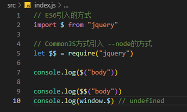
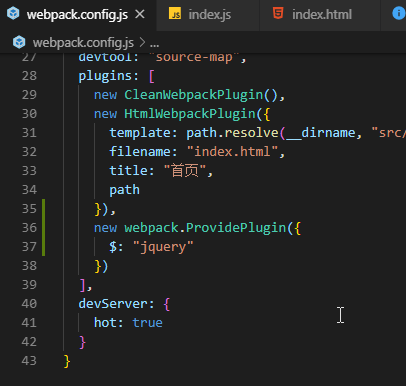
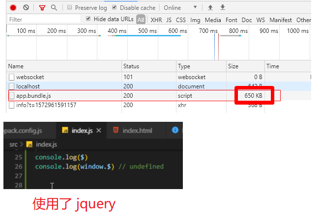
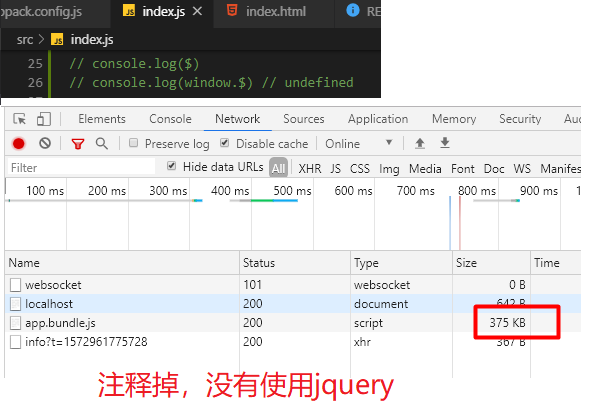

## webpack中打包第三方模块的问题

> 在我们想使用jquery等包的时候，又不想每次都在代码中引入，webpack可以通过一些方式，将这些公用插件自动打包到bundle中

使用方式
1. 在特意不配置webpack的情况下

```
// 安装到生产依赖
npm install jquery --save

// 直接在 src/index.js中使用， 如下图，都是可以
```


但是这种使用，jquery是不会挂载到window上的

2. 使用 expose-loader 来加载， 下面的内联loader 详细从配置到使用

> 上面2种方式，都需要手动去引入第三方模块，没有自动注入到全局，依旧繁琐，每一个业务的js逻辑，第一行都要将我们的依赖包手动 require或者import引入。

3. 使用webpack插件解决包的全局暴露问题 -- 一次注入到每个模块中，可直接使用。

- 使用 new webpack.ProvidePlugin() 注入
> 这种方式的注入，并不会将第三方包例如 jquery挂载到window上，是可以直接使用$，但是window.$会是undefined
- 如果我们在所有模块都注入了第三方包，但是又引入了 在线CDN，但是为了模块化考虑，又使用require的方式引入，webpack就会再打包一次，重复打包，那么我们的bundle提及就会变大，具体使用详情，看下面的 externals


## loader 分类

- 内联loader， 使用 ! 分割多个loader

安装 expose-loader

```
npm install expose-loader --save-dev
或
yarn add expose-loader -D
```
> expose-loader 暴露全局的loader， 写在具体业务的js中的

src/index.js
```
import $ from "expose-loader?!jquery"
// 上面是将jquery挂载到window上，暴露到全局

import Styles from 'style-loader!css-loader?modules!./styles.css';

// 通过这种方式将 jquery 挂载到window上
// $2就是window.$2 挂载到window上的，$3没有挂载到window上
import $3 from "expose-loader?$2!jquery"
console.log("内联jquery", $3 === window.$2)
console.log($3("body"))
```
通过前置所有规则及使用 !，可以对应覆盖到配置中的任意 loader。
[内联loader-webpack官网](https://www.webpackjs.com/concepts/loaders/#inline)

这种内联loader，也可以在webpack.config.js中配置
webpack.config.js

```
module.expots = {
  module: {
    rules: [
       {
        test: require.resolve("jquery"),
        use: [{
          loader: 'expose-loader',
          options: '$'
        }]
      }
    ]
  }
}
```
在 src/index.js中直接使用
```
// 通过在webpack中配置plugin， 使用expose-loader
require("jquery")
console.log($("body"))
```

- pre
> 前面执行的loader
- normal loader  普通loader
- 后置loader

### loader的加载顺序

pre(前缀) --> normal(普通loader) --> inline-loader(行内loader) --> post(后置loader)


### 行内loader使用详情
加入some-loader是一个自定义的loader


```
let str = require("-!some-loader!./a.js")
```
>说明： loader前面加 -! 表示文件不会通过 pre 和normal loader处理


src/test.js
```
// 引入a.js, 通过 some-loader解析
let str = require("!some-loade!./a.js")
```
> 说明： loader前面一个! 表示 引入的资源不会让normal 普通loader去解析，如果有 pre 和post 会通过他们解析

src/test.js
```
let str = require("!!some-loader!./a.js")
```
> 说明： !! 表示不需要 pre 和normal 和post loader处理a.js 只使用 some-loader处理引入的资源


### webpack.config.js中loader的使用方式（2种）
> 下面演示的是多个loader会依次处理同一种文件类型的资源

loader的执行顺序是 从 **右往左， 从下往上** 执行


#### 单个loader的使用
```
module.exports = {
  module: [
      rules: [
        {
          test: /\.js$/,
          use: "babel-loader"
        }
      ]
    ]
}
```

#### 多个loader使用
> 下面这种，是不配置option的
webpack.config.js
```
module.exports = {
  module: [
    rules: [
      {
        test: /\.js$/,
        use: ["loader3", "loader2", "loader1"]
      }
    ]
  ]
}
```

多个loader处理同一种文件 比如 
webpack.config.js
```
module.exports = {
  module: [
    rules: [
      {
        test: /\.js$/,
        use: "loader3",
        
      },
      {
        test: /\.js$/,
        use: "loader2"
      },
      {
        test: /\.js$/,
        use: "loader1"
      }
    ]
  ]
}
```
> 上面的loader是先执行 loader1 --> loader2 --> loader3

## 自定义loader
> webpack中的loader就是一个函数，类似下面的写法

定义 loader/loader1.js
```
function loader(resource) {
  console.log("loader1")

  // loader的入参是我们处理的资源，比如css源码，js源码,
  // 所以,这里在经过自定义loader处理完成以后，一定要 return 回去
  return resource
}

module.exports = loader
```
同理，可以在loader目录下面建立n个自定义loader ，形如上面， loader1, loader2, loader3 ...

使用 webpack.config.js

```
const path = require("path")
module.exports = {
  module: {
    rules: [
      {
        test: /\.js$/,
        use: path.resolve(__dirname, "loader", ""loader1.js")
      },
      {
        test: /\.js$/,
        use: path.resolve(__dirname, "loader", ""loader2.js")
      },
      {
        test: /\.js$/,
        use: path.resolve(__dirname, "loader", ""loader3.js")
      }
    ]
  }
}
```

> 这里使用loader以后，打印的console顺序是 loader3, loader2, loader1

loader是从下往上执行的

通过使用规则，能够改变顺序

```
const path = require("path")
module.exports = {
  module: {
    rules: [
      {
        test: /\.js$/,
        use: path.resolve(__dirname, "loader", ""loader1.js"),
        enforce: "pre"
      },
      {
        test: /\.js$/,
        use: path.resolve(__dirname, "loader", ""loader2.js")
      },
      {
        test: /\.js$/,
        use: path.resolve(__dirname, "loader", ""loader3.js"),
        enforce: "post"
      }
    ]
  }
}
```
> 指定了 enforce 强制先使用 loader1 再使用loader2 再使用 loader3, 没有添加 enforce配置的，都是 normal loader

### 自定义loader 解决loader查找路径问题

现在上面的loader查找是从 loader目录下面查找的，这里每次都要path.resolve，比较麻烦


配置别名，解决查找自定义loader路径的问题
webpack.config.js
```
const path = require("path")
module.exports = {
  resolveLoader: {
    // 配置别名
    alias: {
      loader1: path.resolve(__dirname, "loader", ""loader1.js"),
      loader2: path.resolve(__dirname, "loader", ""loader2.js"),
      loader3: path.resolve(__dirname, "loader", ""loader3.js")
    }
  }
  module: {
    rules: [
      {
        test: /\.js$/,
        use: "loader1",
        enforce: "pre"
      },
      {
        test: /\.js$/,
        use: "loader2"
      },
      {
        test: /\.js$/,
        use: "loader3",
        enforce: "post"
      }
    ]
  }
}
```

配置loader的查询路径，解决查找自定义loader路径的问题

webpack.config.js
```
const path = require("path")
module.exports = {
  resolveLoader: {
    // 配置查询路径
    modules: ["node_modules", path.resolve(__dirname, "loader")]
  }
  module: {
    rules: [
      {
        test: /\.js$/,
        use: "loader1",
        enforce: "pre"
      },
      {
        test: /\.js$/,
        use: "loader2"
      },
      {
        test: /\.js$/,
        use: "loader3",
        enforce: "post"
      }
    ]
  }
}
```
配置了自定义loader的查询路径以后，会先去node_modules目录查找， 找不到再去 loader目录查找


## 在业务中引入包的方式
- CommonJS -- node

```
const a = require("./a.js")
```
- ES6 
```
const a from "./a.js"
```
示例： 
src/index.js
```
// ES6引入的方式
import $ from "jquery";
console.log($("body"))

// CommonJS方式引入 --node的方式
let $$ = require("jquery")
console.log($$("body"))
```

---
## provide-plugin

[provide-plugin- webpack官网](https://webpack.js.org/plugins/provide-plugin/#root)

- provide-plugin查找包的路径从当前目录下和node_modules中查询
- 可以指定包的完整路径，不指定路径，就会去node_modules下找

webpack.config.js
```
const webpack = require("webpack")
const path = require("path")

module.exports = {
  entry: {...},
  plugins: [
    // 传入一个对象
    new webpack.ProvidePlugin({
      // 从指定的src路径去加载jquery包
      $: path.resolve(__dirname, "src/plugin/jquery.min.js"),
      // 从node_modules中加载，前提是 npm install jquery --save
      jQuery: "jquery",
      // 上面2种方式只是暴露了占位符$和jQuery到全局，并没有挂载到window上面, 下面就挂载到全局
      "window.$": "jquery"
    })
  ]
}
```

**Question**
1. 使用了暴露全局的ProvidePlugin， 但是某一个业务中并未使用它，也没有使用上面的占位符，一个业务中，从始至终都没有用jquery，那么，这个bundle会不会变小

>  没有使用，就不会动态注入，bundle的提及自然变小

webpack.config.js配置

下面是network对比图
在src/index.js中使用了$符号(占位符)  bundle大小是 650k



没有使用的 -- 大小375k


通过对比图，发现，ProvidePlugin是动态注入的，没有在业务中使用，就不会打包进去


2. 使用了在线CDN库，但是又使用require的方式引入，导致打包的js体积变大，如何避免？ 
> 在使用了线上CDN库以后，比如jquery,Vue 这些都会挂载到window下面，单纯的使用CDN是不会被webpack打包处理的， 但是，又希望模块化的方式使用，使用require引入了， 就会被打包进bundle，导致体积增大

[externals-webpack官网](https://www.webpackjs.com/configuration/externals/)

src/index.html
```
...其他code
// 引入线上CDN
<script src="https://cdn.bootcss.com/jquery/2.2.3/jquery.js"></script>
```

src/index.js

```
// 然后又希望模块化，使用require导入
const $ = require("jquery")
```
webpack.config.js中的ProvidePlugin继续保留

像上面这种形式， 就会再次打包，导致包体积变大

使用externals 配置，告知webpack不要重复打包

webpack.config.js

```
module.exports = {
  entry: {...},
  output: {...},
  plugins: [

  ],
  externals: {
    jquery: "jquery"
  },
}
```
注意externals配置项是和output等平级配置的, 配置完 externals，再对比bundle的大小，发现少了一半体积

---

## 小结

上面详细介绍了几种引入第三方模块的方式

1. expose-loader 挂载到window上
2. new webpack.ProvidePlugin() 给每一个打包的文件提供占位符
3. 引入CND 不打包

还有loader的分类以及使用


