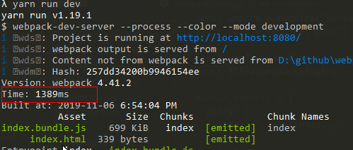
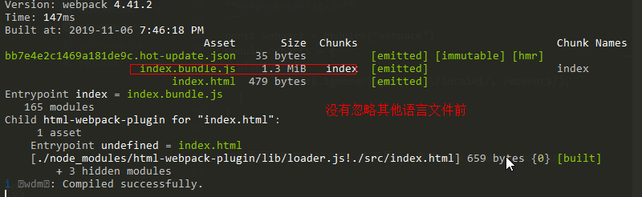
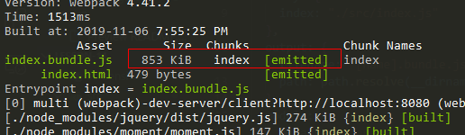
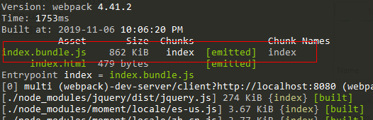
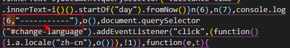
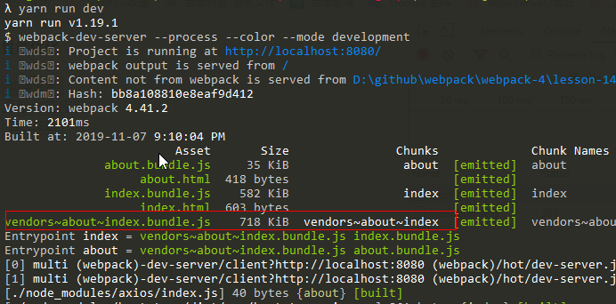
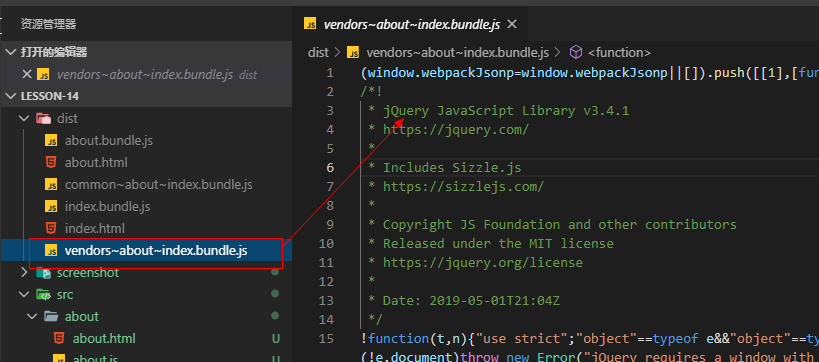

## webpack优化

###  1.module.noParse
> 配置了这个以后，webpack在打包时，不再解析这些库，跳过分析，加快打包速度， 配置这个，说明我们指定的包或者模块，与其他包没有依赖关系
> 比如jquery， lodash，它不依赖其他包，所以，可以配置   
>  该参数接受一个正则或者function

> 存在多个不需要被解析的，使用竖线分割，其实就是正则的 或 |

**webpack.config.js**

1. 正则
```
module.exports = {
  module: {
    noParse: /jquery|lodash/, // 不去解析jquery中的依赖
    rulues: [
      ....其他配置
    ]
  }
}
```
2. function

```
module.exports = {
  module: {
    noParse: function(content) {
      // 一定要有返回值
      return /jquery|lodash/.test(content)
    }
  }
}
```


这个优化，主要是体现在代码的构建速度上，并不对生产环境产生任何性能上的提升
对比添加 noParse 时控制台的 Time



### 2. babel-loader 只转换解析源码，不转换node_modules下的js文件
> 使用babel-loader将ES6及以上的代码转换成ES5的代码，如果不配置忽略node_modules 它默认会将node_modules下的包全部转化成ES5

```
const path = require("path")
module.exports = {
  module: {
    rules: [
      {
        test: /\.js$/,
        //排除node_modules
        exclude: /node_modules/,
        // 只转换 src目录下的js
        include: path.resolve(__dirname, "src"),
        use: {
          loader: "babel-loader",
          options: {
            presets: ["@babel/preset-env"]
          }
        }
      }
    ]
  }
}
```

### 3. 针对多语言，排除不需要的语言包
[webpack.IgnorePlugin](https://www.webpackjs.com/plugins/ignore-plugin/)

> 多语言的情况下，我们并不需要加载所有的语言包，可能只需要中文包和英文报，但是多语言会将所有的语言文件都发送到用户客户端，打包也会导致提交增大
**webpack.config.js**
```
const webpack = require("webpack")
module.exports = {
  plugins: [
    new webpack.IgnorePlugin(/^\.\/locale$/, /moment$/),
  ]
}
```

如果需要忽略其他的文件，多写几行，类似 new HtmlWebpackPlugin一样



忽略以后


bundle体积明显变小
那么我们需要语言包的时候，怎么办？

我们在程序的通用的js中或者当前业务的js中 import 所需要的包，即可

**index.js**
```
import moment from "moment"
import "moment/locale/zh-cn"
import "moment/locale/es-us"
```
index.bundle.js的体积增大一点点，但是只打包了中文和英文的语言包
与打包所有的locale相比，已经小了几百k



### 4. 动态库链 - DllPlugin
[webpack优化(4)——DllPlugin动态链接库](https://blog.csdn.net/qq_17175013/article/details/86999614)
> 动态库链的目的就是将一些第三方包打包到一起，在使用的时候，从已经打包的文件中直接使用，不再二次构建，提升构建速度

> 我们可以提前将 react react-dom 提前构建成dll 然后在使用的时候，直接用，并不需要二次构建打包，因为这些包基本是不会频繁变动

#### 操作步骤

1. 新建一个打包的配置文件
> 用来打包第三方包，导出成单独的文件

webpack.react.config.js

```
const webpack = require("webpack")
const path = require("path")

module.exports = {
  entry: {
    react: path.resolve(__dirname, "src/test.js")
  },
  output: {
    filename: "[name].js", // 引入的包名叫什么，这里输出就叫什么 test.js
    path: path.resolve(__dirname, "dist"), // 将打包好的直接输出到dist目录
    library: "ab",
    libraryTarget: "var"
  },
   plugins: [
    new webpack.DllPlugin({
      name: "_dll_[name]", // 这里的name 和 output.library 要同名,不然找不到模块
      path: path.resolve(__dirname, "dist", "manifest json"), // 打包输出的目录，名称必须叫 manifest json
    })
  ]
}
```

output.library 最终暴露出怎么样的一个对象，取决于 output.libraryTarget 这个选项

[output.libraryTarget](https://www.webpackjs.com/configuration/output/#output-librarytarget) 可选的值

- var
> 将打包后的结果赋值给一个变量，变量名就是 library指定的字符串 var ab = (....webpack打包的代码)() 闭包
> 那么在使用的时候，可以直接使用 ab.dosomething() 等方法，如果不暴露出来，webpack打包后，闭包内部的东西，是无法访问的
- assign
- this
- window
- global
- commonjs
> 导出成nodejs中使用的方式
- amd
> 以AMD模块化的方式导出，使用自然以AMD的方式导入使用

AMD定义一个模块
```
define("MyLibrary", ["jquery", "axios"], function($, axios) {
  
  return {
    say() {
      console.log("AMD的say方法")
    },
    version: "1.0.0"
  }
})
```
AMD第二个参数是依赖项， MyLibrary 依赖什么，比如jquery,axios, 对用的工具对象通过最后一个回调函数的入参依次传入

AMD 使用模块
```
require(["MyLibrary"], function(MyLibrary) {
  MyLibrary.say()
})
```

- umd

2. 使用 webpack内置插件  new webpack.DllPlugin 形成包的清单manifest json
> 这个清单相当于包的入口，从这里面可以找到打包后暴露的方法名，以及依赖关系

3. 在主打包入口 webpack.congig.js中使用这个第二步的这个清单

```
const webpack = require("webpack")

module.exports = {
  ... 其他配置
  plugins: [
     new webpack.DllReferencePlugin({
        manifest: path.resolve(__dirname, "dist", "manifest.json")
    })
  ]
}
```

这里最主要的是引用第二步打包好的文件,如果这个manifest.json不存在，则会将react和react-dom 打包到bundle中

4. 修改 package.json中的scripts 执行指令
> 因为我们在打包主 webpack.congfig.js时，会使用 new CleanWebpackPlugin() 那么就会清除dist目录，所以，要保证dll的清单的形成要在 运行webpack.congfig.js之后
**package.json**
```
"scripts": {
  "dev": "webpack-dev-server --process --color --mode development",
    "build": "webpack --mode production",
    "build:reactDll": "webpack --config webpack.react.config.js",

    "build:all": "yarn run build:reactDll && yarn run build",
    "dev:all": "yarn run build:reactDll && yarn run dev"
}
```
主要使用下面的 buld:all 和 dev:all

其实也可以这样，我们使用 [copy-webpack-plugin](https://www.webpackjs.com/plugins/copy-webpack-plugin/) 将打包后的dll拷贝到dist目录也可以，那么我们 webpack.react.config.js的输出目录修改到另一个目录就可以，比如 /libs目录

只要保证主 webpack.config.js先运行，webpack.react.config.js后运行即可

5. 在业务代码中，使用script:src 的方式引用第二步打包的文件 __dll_react.js

**about.html**
```
  <script src="./_dll_react.js"></script>
```
about.html自己的js bundle会通过html-webpack-plugin 指定的chunks引入进来，会自动插入


## 5. 多线程打包webpack の thread-loader
[thread-loader](https://www.webpackjs.com/loaders/thread-loader/)
> 使用多线程打包资源

> 小型的项目，使用多线程反而没有速度上的提升，大型项目会有明显变化


## 6 tree-shaking 
[tree-shaking ](https://www.webpackjs.com/guides/tree-shaking/)
> import 在生产环境下，会自动去掉没有使用的代码, 在开发环境中，还是存在的

> 一定要使用 ES6的 export 和 import 进行模块的导入和导出， 不要使用 CommonJS的 require ，因为CommonJS的在生产环境并没有无用的代码剔除掉

src/math.js

```
export function sum(a,b) {
  return a + b
}

export function cube(x) {
  return x * x *x
}
```

src/index.js
```
import lib from "./math.js"
// 只使用 sum，并没有使用 cube
lib.sum(1,2)
```

**Question**
1. 启用生产环境，在打包以后,在bundle中找不到引用过的方法？
> webpack的 mode 指定为 production 是，就默认启用了 UglifyJsPlugin ，代码就被混淆了，所以找不到


## 7. 代码混淆 - uglifyjs-webpack-plugin
[uglifyjs-webpack-plugin](https://www.webpackjs.com/plugins/uglifyjs-webpack-plugin/)

安装
```
npm i -D uglifyjs-webpack-plugin
或
yarn add uglifyjs-webpack-plugin -D
```

使用 
webpack.config.js
```
const UglifyJsPlugin = require('uglifyjs-webpack-plugin')
module.exports = {
  mode: "production",
  new UglifyJsPlugin(),
}
```

尽量在生产环境下使用这个包，因为在开发环境混淆代码并没有必要，而且还增加构建时间


## 8. scope-hosting 变量提升

src/index.js
```
let a = 1;
let b = 2;
let c = 3;
let d = a + b + c;
console.log(d)
```
在执行 npm run build 以后，发现没有 a b c 了，直接输出计算值



webpack会自动简化我们的代码

## 9. 抽离公共代码
[Optimization](https://webpack.js.org/configuration/optimization/)
webpack中文网没有明确的入口讲解这个，英文网有

> 在index.html中有使用 a.js和b.js， 在about.html也有用到这个2个js包， 如果我们将2个包抽离成单独的包，在浏览器再次检测到这个包存在时，会使用缓存文件

> webpack 4.x会根据我们的 mode是 production还是 development来优化我们的代码，我们也可以手动配置优化项，覆盖默认的

**webpack自动切割代码的条件**
- 共享的新chunk，和来自node_modules中的文件
- 压缩前，新chunk大于 30k的会被切割
- 在按需加载块时并行请求的最大数量将低于或等于5。
- 在初始页面加载时并行请求的最大数目将低于或等于3。

当试图满足最后两个条件时，更大的块是首选的。

从node_modules中引用的包，会被默认打包进 一个叫vendors的chunk中，且在所有文件中使用次数超过2次

```
module.exports = {
  entry: {

  },
  output: {

  },
  optimization: {
    minimizer: [数组], 压缩，最小化
    splitChunks: {
      // 默认使用 SplitChunksPlugin作为切割最小块chunks
      // 这里的options和 SplitChunksPlugin一样

      automaticNameDelimiter: "~", 切割出来的chunk的name用什么分隔符分割,默认~ vender~main.js
      automaticNameMaxLength: 
    },
    runtimeChunk: 
  }
}
```
optimization配置项与 entry 和 output配置同级，这是要注意的

priority越大，就越优先切割打包，自定义的 缓存组(cacheGroups)的优先级是0， 默认缓存组是 -20

[split-chunks-plugin](https://webpack.js.org/plugins/split-chunks-plugin/)
[webpack4 SplitChunks配置详解--简书](https://www.jianshu.com/p/0f03b6a0dd6c)

**Question**
1. 将公共代码抽离成单独的chunk以后，打包发现我们的html中并没有插入打包的公共文件

splitChunks.cacheGroups.{name}

```
module.exports = {
  output: {
    filename: "[name].bundle.js",
    path: path.resolve(__dirname, "dist")
  },
  optimization: {
    splitChunks: {
      cacheGroups: {
        vendors: { // 第三放模块的名字
         test: /[\\/]node_modules[\\/]/, // 如果是从node_modules中找的模块，就抽离出来
          chunks: "initial",
          minSize: 0, // chunk的大小大于0 就被单独抽离成chunk
          minChunks: 0, // 某个模块被引用0次以上才抽离成单独的chunk
        },
        common: { // 自己写的公共模块

        }
      }
    }
  },
}
```

这个vendors是可以自己起名字的， 最终打包出来的名字是 vendors~a(模块)~b(模块)~(output.path指定的filename)

output.filename: [name].bundle.js  这个name是占位符



这个代码是抽离出去了,但是抽离的公共的chunk并没有插入到我们的html中，不管是开发环境还是生产环境，都没有以script:src 的形式插入？

> 多页应用的情况下，我们其实是利用 html-webpack-plugin这个插件去解决的，单页应用也一样


```
const HtmlWebpackPlugin = require("html-webpack-plugin")
module.exports = {
  optimization: {
    splitChunks: {
      cacheGroups: {
        common: { // 自己公司内部的包
          // 这里的name和下面 HtmlWebpackPlugin的chunks中一一对应
          name: "common",
          
        },
        vendors: { // 第三方包
          name: "vendors"
        }
      }
    }
    // ... 省略这里如何优化，看上面和下面的示例重点是plugins中的配置
  },
  plugins: [
    new HtmlWebpackPlugin({
      template: "src/index.html",
      title: "首页",
      // 最主要的就是这里的chunks
      chunks: ["vendors", "common", "index"]
    }),
    new HtmlWebpackPlugin({
      template: "src/about/about.html",
      title: "关于我们",
      // 最主要的就是这里的chunks
      chunks: ["vendors", "common", "about"]
    })
  ]
}
```
通过chunks，我们可以知道这样页面依赖哪些模块(js)， 这里插入的 common和 vendors与 optimization.splitChunks.cacheGroups.{缓存组名字}.name
是有直接关系的
如果我们使用name重写缓存组输出的名字，那么将非常的长，也不方便使用


这里的chunks来源就是 缓存组被重命名的 name， 然后我们只要组织好 chunk中的依赖关系即可 

先引入第三方 vendors ---> 再引入公司内部的 common---> 再引入当前页面的业务逻辑 index

2. 在配置多个缓存组的时候 cacheGroups 怎么将第三方包和我们自己写的公共组件抽离成不同的文件?
> 有一些是公司特定场景的公共组件，有一些是第三方的包，比如jquery， axios，我们希望将自己公司的包抽离成一个chunks，将第三方的抽离成一个chunks

webpack.config.js
```
module.exports = {
  optimization: {
    splitChunks: {
      cacheGroups: { // 可以设置多个缓存组
        common: {
          // 公司内部的包
        },
        vendors: {
          // 第三方的包，比如jquery axios lodash
          test: /node_modules/,
          priority: 10, // 设置权重，保证vendors比common先抽离，否则抽离了common，就不会再运行到vendors这里
        }
      }
    }
  }
}
```

上面的splitChuns，不加入参数干扰的话，是从上到下抽离的，针对第三方包vendors，必须加权重 priority 否则，在打包的时候，会发现只有上面的common 的chunks，不会有vendors的chunks

抽离后 npm run build 打包后的结果


3. 如果在 cacheGroups.name 指定了这个名字以后，就会覆盖默认生成chunks 名字的规则
默认是 vendors~模块a~模块b.(output.filename).js
指定了name以后，就是 name.(output.filename).js

```
不指定
cacheGroups: {
  common: {
    //name: , 不指定这个
  }
}
// 产出的名字类似下面的
common~about~index.bundle.js


// 指定了以后
cacheGroups: {
  common: {
    name: "ctdLibs"// 指定生成的名字
  }
}

ctdLibs.bundle.js
```

4. 在打包以后，不确定是否响应的公共组件都打包到一起去了，但是代码有被压缩了，怎么在不使用格式化的情况下，在npm run build以后还能看到展开的代码?

> webpack在指定了 mode 为production的时候，会自动启臫代码压缩，也就是 optimization.minimize: true， 将这个压缩改为false， 或者将mode改为 developmet再打包，就不会被压缩

webpack.config.js
```
module.exports = {
  mode: "production",
  optimization: {
    minimize: false, // 禁用代码压缩
  }
}
```
[optimization-官网](https://webpack.js.org/configuration/optimization/)


## 10 webpack配置代码懒加载

## 11 webpack 代码热更新

## 

### 参考链接

1. [webpack优化-俞华](https://blog.csdn.net/qq_17175013)


