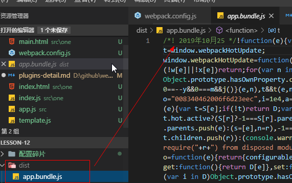

## webpack插件集合踩坑指南

- [autoprefixer](https://github.com/postcss/autoprefixer)  添加浏览器标识前缀 -webkit 等
- [postcss-loader](https://github.com/postcss/postcss/blob/master/README-cn.md) 集成插件，可以在这里配置 autoprefixer 
- [css-loader]() 解析 @import语法
- [style-loader](https://webpack.js.org/loaders/style-loader/#root) 将解析好的样式插入到heade中
- [file-loader]() 
- [html-webpack-plugin]()
- [clean-webpack-plugin]()
- [glob]() 快速获取文件列表


---
### autoprefixer 

**注意事项**
1. autoprefixer 是依赖一个 浏览器标识列表 （Browserslist）的，根据列表，它就知道哪些是需要被转换的，添加浏览器前缀
2. Browserslist 配置，你可以在 package.json中加这个字段，或者单独在项目的根目录，和package.json同级，新建一个 .browserslistrc 文件，在这个里面写配置

package.json
```js
"scripts": {},
// 与scripts同级设置该属性
"browserslist": [
    "> 1%",
    "last 7 versions",
    "not ie <= 8",
    "ios >= 8",
    "android >= 4.0"
]
```

3. 强烈建议将这些选项通过设置browserslist配置来告知 autoprefixer,而不是通过参数传递进去，因为参数传递，只有 auotoprefixer 能接收到，通过创建单独文件.browserslistrc 或者指定package.json 中的browserslist， 就可以将这个配置共享给其他的插件使用，比如 babel-preset-env、 stylelint

### Question

1. Autoprefixer polyfill 可不可以在IE中支持栅格系统？
autoprefixer 可以在IE10, IE11 中支持 栅格系统（Grid System）, 但是不是100% 支持所有语法， 所以，autoprefixer 默认是禁用它的

如果要使用它 栅格语法：
    1.1 启用它  grid: "autoplace"
    1.2 使用栅格语法后，你需要在IE中测试，你写的是不是都生效了，特别是在生产环境
    1.3 只有非常有限的 auto placement 支持 ， [grid-autoplacement-support-in-ie](https://github.com/postcss/autoprefixer#grid-autoplacement-support-in-ie)

**webpack中使用**
webpack.config.js
```js
module.exports = {
  module: {
    rules: [
      {
        test: /\.css$/,
        use: ["style-loader", "css-loader", "postcss-loader"]
      }
    ]
  }
}
```
loader  从右往左解析，所以，先加浏览器前缀，用到 Postcss-loader, 然后解析css（css-loader） , 解析完以后，插入到head标签，使用 style-loader

创建postcss.config.js 文件
```js
module.exports = {
  plugins: [
    require('autoprefixer')
  ]
}
```
---
### css-loader

> css-loader 是用来解析模块中通过@import 或者 url()的引入的样式

test.css文件
```js
// 第一种
@import "./header.css"
或
@import url("./header.css")
上面这2种没区别
```

a.js 文件
```js
// 第二种
import t from "footer.css"

// 第三种
url(image.png) => require('./image.png')
url('image.png') => require('./image.png')
url(./image.png) => require('./image.png')
url('./image.png') => require('./image.png')
url('http://dontwritehorriblecode.com/2112.png') => require('http://dontwritehorriblecode.com/2112.png')
image-set(url('image2x.png') 1x, url('image1x.png') 2x) => require('./image1x.png') and require('./image2x.png')
```

css-loader中通过 url的方式从node_moduls中加载静态资源，如果配置了别名，使用别名 ~去代替

```js
url(~module/image.png) => require('module/image.png')
url('~module/image.png') => require('module/image.png')
url(~aliasDirectory/image.png) => require('otherDirectory/image.png')
```

**url**
可以在webpack.congig.js中配置是否启用 url加载静态资源
webpack.config.js

```js
module.exports = {
    module: {
        rules: [
            {
                test: /\.css$/,
                loader: "css-loader",
                options: {
                    url: true/false
                }
            },
            // url接受一个Function，这个Function作为一个过滤器，表示哪些资源是需要被解析的，哪些是不用解析
            {
                test: /\.css$/,
                loader: "css-loader",
                options: {
                    url: (url, resourcePath)=> {
                        // 解析 resourcePath - path路径的文件

                        // 过滤掉，不解析 img.png图片
                        if(url.inculdes("img.png")) {
                            return false
                        }

                        return true
                        
                    }
                }
            }
        ]
    }
}
```

**import 配置**
>   默认是true, 是否启用通过 @import 加载静态资源，通过@import加载的资源，在运行时，会将静态资源加载到代码中

```js
@import 'style.css' => require('./style.css')
@import url(style.css) => require('./style.css')
@import url('style.css') => require('./style.css')
@import './style.css' => require('./style.css')
@import url(./style.css) => require('./style.css')
@import url('./style.css') => require('./style.css')
@import url('http://dontwritehorriblecode.com/style.css') => @import url('http://dontwritehorriblecode.com/style.css') in runtime
```

如果样式文件在 是从node_moduls路径下导入的，支持别名， 使用~代替

```js
@import url(~module/style.css) => require('module/style.css')
@import url('~module/style.css') => require('module/style.css')
@import url(~aliasDirectory/style.css) => require('otherDirectory/style.css')
```

**tips**
1. 使用@import 导入样式的时候，一定要写在当前style的第一行，因为这个是必须先于其他规则引入，除了 @charset="utf8"之外

```js
<style>
@import "./header.css"

body {
    color: red;
}
</style>
```

下面是错误的

```js
<style>
body {
    color: red;
}
// 顺序错误
@import "./header.css"
</style>
```

2. 通过link加载样式与@import 加载的区别
- link是标签，@import 不是标签
- link不仅可以导入样式，还可以定义 RSS，rel等链接属性， @import只能导入样式
- link加载顺序是在页面加载的时候，同时被加载的； @import是在页面加载完毕后，才开始加载的
- link支持用js操作DOM控制样式， @import不行
- @import IE5+ 才可以使用， link是标签，没有兼容性 （这条可以省略）


---
### style-loader
>   就是将样式注入到DOM中，就是内部样式表，通过style的方式加载到header中

>   这个插件是要配合css-loader一起使用，style-loader单纯的只负责将样式通过style的方式插入，至于样式使用什么写的，less,sass等，它不管，css-loader也不会去解析 @import导入的样式

在某个组件中，直接通过下面的方式使用即可
component.js
```js
import "./header.css"

...其他正常的业务逻辑
```
如果在css模块化的情况下使用

```js
import namespaceHeader "./header.css"

document.getElementById("box").className = namespaveHeader["gray-green"]

```
header.css
```css
.gray-green {
    color: red;
    background: gray;
}
```


webpack.config.js
```js
module.exports = {
    module: {
        rules: [
            {
                test: /\.css$/,
                use:["style-loader", "css-loader"]
            }
        ]
    }
}
```

css-loader先将样式文件都解析好，然后交给style-loader 做注入

#### style-loader 配置项

<span style="color: red;">注:</span>
1. 如果使用style-loader 在webpack.config.js中配置rules的时候，报下面的错误
```js
Style Loader Invalid Options
```
版本问题，0.23.x的配置options就会报错，升级为 1.0.0，配置options就不会报错

```js
rules: [
    {
        loader: "style-loader",
        options: {
            injectType: "singletonStyleTag"
        }
    }
]
```


**injectType**: styleTag(默认) | singletonStyleTag

- styleTag 表示用多个 style注入样式
- singletonStyleTag 用一个 style注入样式，会合并样式, Source maps 下面，这个配置是不生效的
- lazyStyleTag 懒加载css，在你要用的时候，就使用，不用的使用可以卸载，插入的方式和 styleTag 一致
- lazySingletonStyleTag  插入的方式和 singletonStyleTag 一致
- linkTag 将css通过link的方式插入，但是官方推荐，如果你要使用link的形式链入css，就应该参考[MiniCssExtractPlugin](https://webpack.js.org/plugins/mini-css-extract-plugin/) 配置

styleTag 结果
```js
<style>
    a.txt {
        color: red;
    }
<style>
<style>
    b.txt {
        color: blue;
    }
<style>
```
singletonStyleTag 结果
```js
<style>
    a.txt {
        color: red;
    }
     b.txt {
        color: blue;
    }
<style>

```

**attributes  {Object}**
>   配置这个属性，可以给link和 style元素添加属性， 默认是空对象

```js
module.exports = {
    module: {
        rules: [
            {
                test: /\.css$/,
                use: [
                    {
                        loader: "style-loader",
                        options: {
                            attributes: {
                                id: "1",
                                name: "xixi"
                            } 
                        }
                    },
                    "css-loader"
                ]
            }
        ]
    }
}
```
然后生成的 style就是, 如果配置的样式是外部导入的link，那这个属性就会加到link上
```js
<style id="1" name="xixi"></style>
```

**insert**
>   设置 style或者link插入到哪里，默认是在head那里，官方不建议修改

还有生成随机数，就不解释，效果不大


---
### html-webpack-plugin

**参考文档**
 - [插件 html-webpack-plugin 的详解](https://segmentfault.com/a/1190000013883242?utm_source=tag-newest) from segmentfault

### glob
> 在使用webpack 打包多页应用的时候，我们需要读取入口文件的列表，但是又不想一个一个手写，那么可以通过 glob包，帮助我们读取列表

```
npm install glob --save-dev
```

```js
const glob = require("glob")

// 回调函数
/**
 * 如果找到匹配参数1 的文件，就返回文件名称，带路径的
 * 没有找到，就返回空数组
 * 
 */

 /*
    目录层次
    / 
      - src
      |  -js
      |  -view
      |    - about.html
      |    - home.html
      - test
      |  - glob.js
  */
var pattern1 = "../src/*/*"
var pattern2 = "../src/view/*"

glob(pattern2,{
  nodir: true
}, function(err, files) {
  if(err) {
    console.log(err)
    return
  }
  console.log(files)
  
})

// 结果
/**
 * pattern1 会得到的结果是 src下面所有的文件
    [ '../src/js/about.js',
  '../src/js/app.js',
  '../src/js/common.js',
  '../src/view/about.html',
  '../src/view/home.html' ]

    pattern2 会得到view目录下面的所有文件
      [ '../src/view/about.html', 
        '../src/view/home.html' ]
 */
```

既然拿到了列表的路径包括文件名，那么再配合 html-webpack-plugin 循环遍历出需要的多页应用，是比较简单的


**参考链接**
  - [glob 在webpack中的使用。](https://www.cnblogs.com/waitforyou/p/7044171.html)


---
### CopyWebpackPlugin

> 拷贝文件或者文件及到打包后的目录， 会打包到 output配置指定的目录

```
yarn add copy-webpack-plugin -D
```

以下说的打包目录，指的就是 dist目录
webpack.config.js
```
const path = require("path")
const CopyWebpackPlugin = require("copy-webpack-plugin")

module.exports = {
  output: {
    filename: "[name].bundle.js",
    path: path.resolve(__dirname, "dist")
  },
  ....
  plugins: [
    new CopyWebpackPlugin([
      // 第一种 -- 这个会打包到 outpu指定的输出目录
      {from: "src/doc/1.txt"},
      // 第二种 只指要copy的文件, 没有指定要拷贝的具体目录，就会直接拷贝到 dist/ 目录下面
      'src/doc/2.txt',
      // 第三种 指定要copy的文件，和要拷贝的目的地路径
      {from: "src/doc/3.txt", to: "src/doc/3.txt"},
      // 第四种，将文件拷贝到 dist下面的某个目录下面
      {from: "src/doc/4.txt", to: "src/word"},
      // 第五种 直接将一个目录拷贝到 dist目录下面, 没有指定to，都是默认拷贝到 dist目录下面
      {from: "src/test"}
      // 第六种 将from的test目录的内容，拷贝到 dist/test目录， 无论dist/test目录是否存在，原本dist/test目录也不应该存在，因为每次打包，都应该被重新创建
      {from: "src/test", to: "test"}
    ])
  ]
}
```

没有指明 to 具体路径，都是将文件或目录拷贝到 dist/ 下面

- 第一种和第二种是一样的效果，等价
- 第五种 是将 test目录下面的内容直接拷贝到 dist目录，test目录并不会在 dist目录下面被创建
- 发现上面的只要指定了 to这个配置的，都是不需要去设置 成dist/home/a.js， 直接使用 home/a.js 即可
- new CopyWebpackPlugin9([copy-1, copy-2], 配置项) 参数1位置是一个数组，就是可以指定多个需要拷贝的指令， 参数2是一个对象
- 要拷贝多个，就配置多个

```
new CopyWebpackPlugin([], {
  context: compiler.options.context, // 指定拷贝的 from 的上下文路径
  ignore: [], // from中那些文件是被忽略，不拷贝的，这是应用于所有的from的
  copyUnmodified: Boolean, // 默认false 在使用watch | webpack-dev-server 对文件监控时，只拷贝第一次，无论后面要拷贝的文件是否发生变化，都不再拷贝 
  debug: "warming | info | debug"  // 这个参数没什么用, warming和 info从控制台没看到有什么区别
})
```

上面只是简单的使用，copy使用，如果要跨文件目录层次，也是可以的
比如 
将含有 c目录下面的所有文件，拷贝到dist/doc目录下
```
from: src/a/b/c/  to doc/
// 可以写成
from: src/**/**/c to doc/
```
---

### BannerPlugin
> 为每一个chunk文件，添加一个版权声明

usage-1
直接传入一个字符串
webpack.config.js
```
const webpack = require("webpack")
module.exports = {
  ... 其他配置项
  plugins: [
    new webpack.BannerPlugin("2019年10月25打包")
  ]
}
```



有多少个chunk文件，就会在每个chunk都添加这个，然后这个只有在打包的时候才会有，在开发环境是没有生成实体的文件。所以只能在浏览器的控制台中看， 在 chrome的network或者sources面板都可以看到


